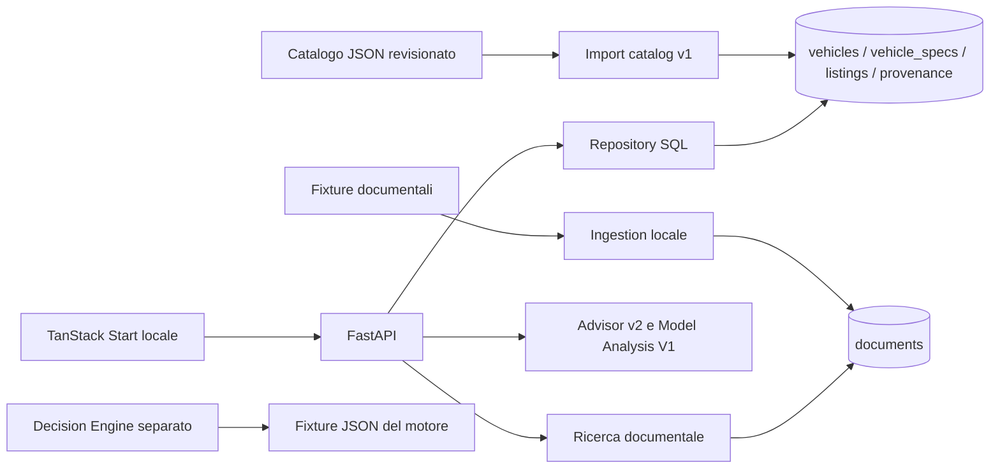
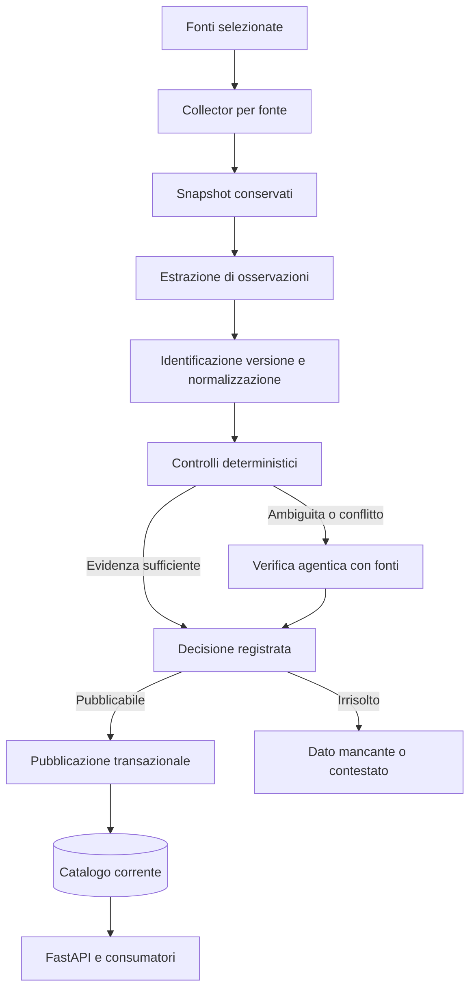

# Revisione dell'architettura e del modello dati

Data: 14 settembre 2026. Checkout verificato: `dc5511e`.
Stato: proposta di evoluzione; nessuna migrazione o modifica del runtime eseguita.

Aggiornamento successivo: i primi due passi sono implementati nel
[contratto catalog v2 e nella migrazione additiva](catalog-v2.md). Le descrizioni
del codice e dei test sotto documentano il momento della revisione iniziale;
il seguito descritto in quel documento aggiunge staging, adozione legacy esplicita,
pubblicazione e adeguamento dei consumatori API. Scraping e integrazione del
Decision Engine separato restano fuori da queste PR.

## Valutazione

Conviene rafforzare il modello prima di raccogliere dati su larga scala. Non serve
riscrivere Drivewise: FastAPI, PostgreSQL, import transazionali e collegamento
annuncio–versione sono una base riutilizzabile. Occorre definire meglio
l'identità delle versioni, il significato delle misure e la separazione tra
osservazioni raccolte e valori pubblicati.

Aggiungere una colonna in seguito è normalmente gestibile. Scoprire che una
versione rappresentava due veicoli diversi richiede invece di separare dati,
annunci, fonti e riferimenti storici. La priorità è stabilizzare queste regole,
non prevedere oggi ogni possibile feature.

La revisione riguarda codice, migrazioni, contratti, fixture e test locali.
Non verifica dati presenti su Neon, deployment o funzionamento del frontend
Lovable esterno. Il costo operativo di una migrazione dipenderà anche dai
volumi e dagli utilizzi effettivi di quel database.

## Architettura effettivamente presente



L'API importa lo scoring da `app.services.advisor.scoring`; non importa
`decision_engine/drivewise_engine`. I documenti che descrivono
Lovable → FastAPI → Decision Engine rappresentano quindi un'integrazione
ancora da realizzare in questo checkout. Il frontend locale è TanStack Start.
Non possiamo dedurre dal repository quale backend utilizzi il client esterno.

Esistono inoltre tre rappresentazioni dei dati: catalogo SQL/import v1,
JSON consumati dal Decision Engine e dataset `mvp-v0.2` per il prodotto.
Sono utili come fixture, ma non devono diventare tre cataloghi di produzione.

Riferimenti: [architettura attuale](architecture.md),
[router Advisor](../apps/api/app/api/routers/advisor.py),
[integrazione prevista](DECISION_ENGINE_INTEGRATION.md),
[modello SQL](data-model.md),
[Decision Engine](../decision_engine/drivewise_engine/engine.py).

## Problemi da affrontare, in ordine

| Priorità | Evidenza nel codice | Conseguenza e intervento |
| --- | --- | --- |
| Prima dello scraping | `vehicles` impone unicità su marca, modello, anno modello e mercato; l'import ripete questa regola. Generazione/fase non sono esplicite. | Due generazioni contemporanee possono collidere, a seconda della denominazione importata. Definire la granularità e correggere insieme vincolo SQL e validazione. |
| Prima dello scraping | `horsepower`, `battery_kwh` e consumi non distinguono tutte le semantiche necessarie. Il frontend etichetta `horsepower` come CV. | Un valore numericamente plausibile può significare altro. Dichiarare unità, componente, procedura e configurazione. |
| Prima dello scraping | Provenienza unica per coppia entità–fonte, aggiornata tramite `ON CONFLICT`; una metrica non può avere due proprietari correnti. | Si conservano alcune fonti divenute storiche, ma non tutte le revisioni della stessa fonte né i valori concorrenti. Serve uno storico delle osservazioni separato. |
| Prima dei dati reali nel prodotto | `list_model_analysis_candidates()` legge specifiche e annunci senza i filtri sulle fonti e sulla freschezza delle raccomandazioni. | Un dato escluso dal ranking può comunque influenzare prezzo e costi in Model Analysis. Condividere la selezione delle evidenze utilizzabili. |
| Prima dell'integrazione del motore | Il Decision Engine è separato e usa anche punteggi sintetici e valori predefiniti. | Riempire le schede tecniche non basta a rendere affidabile il motore. Il contratto deve separare fatti, stime e valutazioni. |
| Prima dello scraping | L'import richiede `seats` e `cargo_volume_liters`; le colonne SQL e le risposte API ammettono null. | Una scheda incompleta non è importabile. Accettare dati incompleti nel catalogo e decidere separatamente quali funzioni possono usarli. |
| Durante l'integrazione | I tipi del dettaglio veicolo frontend omettono campi già restituiti dall'API, tra cui provenienza, chiave versione e consumo elettrico. | Il contratto completo deve arrivare al client perché l'utente possa distinguere versioni ed evidenze. |

Riferimenti puntuali: [schema iniziale](../apps/api/migrations/0002_create_mvp_schema.sql),
[estensione catalogo](../apps/api/migrations/0004_curated_catalog.sql),
[validazione e upsert](../apps/api/app/ingestion/catalog.py),
[repository Advisor](../apps/api/app/repositories/advisor.py),
[schema API](../apps/api/app/schemas/vehicles.py),
[tipi frontend](../apps/web/src/api/drivewise.ts).

Un controllo concreto sul motore evidenzia il rischio dei valori mancanti:
con garage noto e dimensioni del veicolo assenti, `garage_fit()` restituisce
`fits_comfortably`, score `100`, e i filtri non segnalano incompatibilità o dati
mancanti. La causa è l'uso di zero per le dimensioni assenti. È un comportamento
del motore separato, non una prova che l'API attuale lo esegua. Prima di collegarlo,
questo caso deve diventare «non valutabile».

## Modello di identità proposto

Mantenere gli UUID esistenti e le due tabelle centrali. Le chiavi leggibili
esistenti restano identificatori stabili: correggere un nome commerciale non
deve rigenerare un ID.

| Livello | Significato da fissare |
| --- | --- |
| Famiglia | `model_family_key` per raggruppare il modello nel prodotto, anche attraverso anni diversi. Non identifica una versione tecnica. |
| Veicolo di catalogo | `vehicles`: marca, modello, tipo di veicolo, generazione/fase, carrozzeria, mercato, anno modello quando disponibile. Aggiungere gli attributi mancanti senza creare subito tabelle per ogni livello. |
| Versione commerciale | `vehicle_specs`: versione vendibile identificata da `variant_key`, con motorizzazione, trasmissione, trazione, allestimento e periodo di applicabilità. Il nome dell'allestimento da solo non è una chiave. |
| Configurazione della misura | Cerchi, pneumatici, optional o condizioni di misura che modificano una specifica. Restano nel contesto dell'osservazione finché non occorre distinguere una configurazione vendibile autonoma. |
| Annuncio | `listings`: offerta specifica con prezzo, chilometraggio e date, collegata alla versione esatta quando risolta. |

Generazione, restyling, anno modello, produzione e prima immatricolazione sono
concetti distinti. Non dedurre automaticamente l'anno modello dalla prima
immatricolazione. `EU` può descrivere l'ambito di una fonte; non prova che un
allestimento sia stato venduto in Italia. Nel catalogo commerciale usare il
mercato nazionale identificato, mantenendo i casi non risolti tra le osservazioni.

Il tipo `car` / `motorcycle` / `scooter` va previsto come discriminante esplicito,
coerente con la direzione del prodotto. La prima raccolta resta sulle auto:
non servono ora tabelle specialistiche moto o scooter.

Codici del costruttore e identificativi delle fonti sono riferimenti esterni,
non sostituti automatici della nostra identità commerciale. Conservare namespace,
valore e contesto; un codice di omologazione può corrispondere a più versioni
commerciali. Le associazioni ambigue restano candidate e non autorizzano una fusione.

Il nuovo vincolo di unicità deve riflettere questa granularità, con una regola
esplicita per i valori sconosciuti. Non basta aggiungere colonne nullable al
vincolo e presumere che impedisca tutti i duplicati. La migrazione dovrà verificare
collisioni sui dati effettivi prima di sostituire il vincolo legacy.

## Feature: un nucleo tipizzato e osservazioni estendibili

Usare colonne tipizzate per i campi che API e calcoli consumano. Le osservazioni
possono conservare ulteriori metriche con un vocabolario controllato. Non serve
trasformare tutto il catalogo in una tabella generica campo–valore, né creare
centinaia di colonne speculative.

| Gruppo iniziale | Dati e semantica |
| --- | --- |
| Identità | Marca, modello, generazione/fase, carrozzeria, mercato, anno modello, versione, periodo di validità, riferimenti esterni. |
| Propulsione | Alimentazione distinta da architettura ICE/MHEV/HEV/PHEV/BEV; cilindrata e cilindri quando applicabili; cambio e trazione. |
| Potenza | kW come unità canonica, distinguendo motore termico, sistema e potenza continua se dichiarate. Conservare l'unità originale. Non sommare automaticamente le potenze dei motori di un ibrido. |
| Batteria | Capacità lorda e utilizzabile separate; il vecchio `battery_kwh` resta semanticamente incerto finché la fonte non chiarisce. |
| Consumi e autonomia | Valore o intervallo, unità, procedura WLTP/NEDC/altro, ciclo combinato/urbano, alimentazione misurata e configurazione. Per PHEV distinguere almeno consumo ponderato e condizioni della batteria quando disponibili. |
| Ingombri e praticità | Lunghezza, larghezza carrozzeria e con specchi, altezza, posti; bagagliaio con metodo e disposizione dei sedili. Servono anche per il Garage Fit previsto. |
| Emissioni e massa | CO₂ con procedura, classe emissioni, massa con definizione esplicita. |
| Ricarica | Potenza AC/DC dichiarata e condizioni; un picco DC non equivale a una potenza media. Raccogliere quando disponibile senza renderla obbligatoria per ogni auto. |

Il vocabolario iniziale può essere un file versionato, con nome, tipo, unità,
contesti ammessi e validazioni. Non serve un servizio separato per gestirlo.
I nuovi nomi precisi, per esempio `battery_usable_kwh` e `system_power_kw`,
devono avere una sola definizione condivisa da import, API e motore.

Distinguere `unknown`, `not_applicable`, `conflicted` e `verified`: un null da solo
non spiega perché il valore manchi. Zero non è un sostituto del dato sconosciuto.
Le schede incomplete possono esistere; l'idoneità dipende dall'uso richiesto.
Un vincolo fisico obbligatorio non verificabile richiede dati aggiuntivi.

Prezzi di listino, prezzi degli annunci e stime di mercato restano separati.
Affidabilità, comfort, `vehicle_dna`, costi stimati e Decision Score non sono
specifiche tecniche da riempire con lo scraper: richiedono metodi dichiarati,
input tracciabili e, per il Decision Score, il profilo dell'utente.

## Evidenze: tre aggiunte mirate

Proposta di responsabilità, non DDL già pronto da applicare:

| Tabella | Contenuto e invarianti |
| --- | --- |
| `source_snapshots` | Fonte, URL, acquisizione, eventuale data di pubblicazione, hash del contenuto, riferimento al file conservato, formato/esito. Le revisioni sono conservate; lo stesso contenuto può essere riutilizzato senza perdere la data dell'acquisizione. |
| `spec_observations` | Snapshot, metrica, valore originale e normalizzato, unità, contesto, applicabilità temporale e geografica, estratto/posizione nel documento, versione dell'estrattore. Collegamento alla versione solo quando risolto; altrimenti candidati espliciti. Le osservazioni non vengono sovrascritte dal crawl successivo. |
| `fact_decisions` | Versione, metrica e contesto, osservazioni considerate, eventuale osservazione selezionata, stato, motivo, autore umano/regola/agente, versione della procedura e data. Ogni revisione conserva il riferimento alla decisione precedente. |

Una decisione deve poter essere supportata da più osservazioni concordanti.
Le referenze a snapshot, versione e osservazione selezionata devono avere vincoli
referenziali; la pubblicazione verifica inoltre che metrica, unità e contesto
corrispondano. Gli elenchi di evidenze aggiuntive possono iniziare come payload
validati, senza un sistema generico di relazioni.

`vehicles` e `vehicle_specs` diventano la rappresentazione corrente per le letture.
Ogni metrica pubblicata deve rinviare alla decisione che la sostiene. Le tabelle
di provenienza esistenti possono restare come compatibilità per le API v1;
non costituiscono il nuovo archivio delle evidenze.

`documents` resta destinata alla ricerca testuale. Può derivare da uno snapshot,
ma la sua ingestion attuale non è un archivio immutabile del materiale originale.
Nel pilota i file possono restare sotto la directory privata già ignorata
`data/private/catalog/`, con hash e percorso nel database. Lo storage remoto si
aggiunge quando serve condividere i file o eseguire il processo altrove.

## Raccolta, risoluzione e pubblicazione



Il collector acquisisce materiale, l'estrattore propone fatti, il risolutore
valuta le evidenze e un solo percorso di pubblicazione aggiorna il catalogo.
Scraper e agente non devono aggiornare autonomamente le colonne finali.

Ordine dei controlli: identità e applicabilità, unità e procedura di misura,
validità del valore, confronto fra osservazioni equivalenti, risoluzione.
Esempio sintetico: 60 kWh utilizzabili e 64 kWh lordi sono due metriche diverse;
due capacità utilizzabili diverse per la stessa configurazione richiedono verifica.

La verifica agentica riceve un caso circoscritto e restituisce evidenze citabili
e un esito strutturato. Può cercare una scheda più precisa, distinguere contesti,
confermare un valore o astenersi. Il contenuto raccolto è materiale da analizzare,
non istruzioni da eseguire. Budget di richieste, tentativi e tempo sono limitati;
il superamento lascia il caso irrisolto.

La priorità della fonte dipende da metrica, mercato e periodo. Il numero di siti
concordanti non basta, perché possono copiare la stessa origine. La confidenza
espressa dall'agente non è una prova e non coincide con Decision Confidence.

Acquisizione recente e applicabilità recente sono cose diverse: rileggere oggi
una brochure vecchia non aggiorna l'anno a cui si riferisce. L'import attuale
respinge snapshot di record più vecchi; l'archivio delle osservazioni deve invece
accettare una vecchia brochure utile, lasciando al risolutore la scelta del dato.

La pubblicazione aggiorna valore, stato e riferimento alla decisione nella stessa
transazione. Un conflitto sostanziale nuovo deve poter sospendere l'uso del valore
precedente, conservandolo nello storico. Retry idempotenti e serializzazione per
versione evitano che due processi pubblichino decisioni incompatibili.

Per il pilota basta un comando batch Python con pochi adattatori per fonte e
stato persistito in PostgreSQL. Nessun requisito attuale giustifica microservizi,
Redis, database a grafo o orchestrazione multiagente. Il motore di crawling si
sceglie dopo aver verificato le fonti; questo modello non dipende da Firecrawl.

## Consumatori e confini applicativi

Conservare la struttura API → servizi → repository. Condividere una selezione
delle evidenze utilizzabili fra raccomandazioni e Model Analysis, mantenendo
distinte le regole di prodotto: descrivere una scheda tecnica non richiede un
annuncio attivo, stimare un prezzo di mercato richiede offerte comparabili e
datate, valutare il garage richiede dimensioni appropriate.

Separare l'ammissibilità di una fonte dalla certezza del singolo fatto.
`ranking_permission` esiste già e va mantenuto; non significa che ogni valore
raccolto da quella fonte sia corretto. Revoca della fonte o invalidazione della
decisione devono riflettersi in tutti i consumatori interessati.

La direzione dei [Decision Records](DECISIONS.md) è un unico motore deterministico
isolato dal trasporto HTTP e dal database. Raccomando di mantenerla. Il passaggio
dall'Advisor attuale al Decision Engine va però trattato come integrazione
separata, con adattamento esplicito del catalogo e test sui dati mancanti: non
basta sostituire un import Python. I filtri di provenienza dell'Advisor attuale
non devono andare persi.

Nell'integrazione congelare gli input usati da ogni decisione: versione motore,
regole di qualità, istante di valutazione, profilo, valori e riferimenti alle
evidenze. Esistono già `recommendation_runs` e `score_breakdown`: estenderli dove
necessario. I soli ID verso righe mutabili non bastano a ricalcolare il passato.

Il resolver attuale carica tutte le versioni del mercato e le ordina in Python.
È accettabile per il pilota; misurare il costo e restringere i candidati in SQL
prima dell'espansione del catalogo. Non introdurre ora un motore di ricerca.

## Migrazione progressiva

| Passo | Modifica concreta | Criterio di completamento |
| --- | --- | --- |
| 1. Contratto | Fissare identità, vocabolario metriche, stati dei mancanti e distinzione dati/valutazioni. Definire catalog v2 accanto a v1. | Casi sintetici rappresentabili: generazioni contemporanee, stesso allestimento con motori diversi, lordo/netto, intervalli, PHEV, anno sconosciuto. |
| 2. Estensione | Nuove migrazioni additive per attributi e tre tabelle di evidenza; adeguare `import_runs`, oggi vincolata alla versione 1, se usata dal nuovo formato. | Migrazione su database usa e getta con fixture, più seconda esecuzione senza effetti inattesi. Non modificare SQL già applicato. |
| 3. Backfill | Conservare UUID e chiavi; importare i dati precedenti con origine `legacy`/sintetica esplicita. Verificare collisioni prima del nuovo vincolo di identità. | Nessuna inferenza silenziosa su generazione, potenza, batteria o protocollo; mapping esplicito per le separazioni necessarie. |
| 4. Pubblicazione | Aggiungere il percorso osservazioni → decisioni → catalogo e aggiornare l'idoneità dei consumatori. | Conflitto, fonte revocata e dato sconosciuto non diventano un fatto utilizzabile; rollback della transazione verificato. |
| 5. API e motore | Esporre metrica/stato/provenienza nei contratti e adattare il motore scelto. | Nessun falso Garage Fit, nessun punteggio sintetico presentato come osservato; API precedenti compatibili finché necessarie. |
| 6. Pilota | Due fonti, cinque modelli, circa 50–100 versioni; controllo manuale del campione e delle associazioni. | Misurare correttezza del matching, completezza per metrica, falsi confermati, irrisolti, costo e tempo di manutenzione. |

Gli ID si possono conservare per record che mantengono la stessa identità. Se
un record preesistente va separato in due, servono nuove identità e un mapping
revisionato degli annunci; non è corretto promettere che tutti i riferimenti
restino invariati. I risultati storici mantengono l'evidenza usata al momento.

Il rollback applicativo mantiene temporaneamente colonne e letture v1; non deve
richiedere di cancellare le nuove osservazioni. Durante il passaggio mantenere un
solo autore dei valori correnti, evitando che vecchio import e nuovo publisher
si sovrascrivano. Il cambio di granularità, i nuovi vincoli e la ricostruzione
dei riferimenti sono la parte più delicata; le colonne additive sono la parte
meno rischiosa.

La copertura va misurata su un perimetro dichiarato, per esempio versioni offerte
in Italia in un determinato periodo. Completezza dei campi, numero di versioni
e quota delle immatricolazioni sono indicatori diversi. Senza un elenco di
riferimento o un denominatore verificato non dichiarare una percentuale del
mercato europeo.

## Verifiche eseguite e limiti

Comandi eseguiti in questa revisione:

```sh
.venv/bin/python -m pytest apps/api/tests/test_catalog_import.py apps/api/tests/test_vehicle_resolver.py apps/api/tests/test_catalog_coverage.py apps/api/tests/test_model_analysis_api.py apps/api/tests/test_migrations.py -q
PYTHONPATH=decision_engine .venv/bin/python -m pytest decision_engine/tests -q
```

Esito: **53 passati e 3 saltati** per i controlli API/catalogo selezionati;
**11 passati** per il Decision Engine. I tre test di integrazione database sono
saltati perché `TEST_DATABASE_URL` non è configurata. Non è quindi verificata
qui l'esecuzione SQL su PostgreSQL, né una migrazione dei dati reali.

Verificati inoltre direttamente, senza scritture: rifiuto di `seats=null` nel
modello di import e falso esito positivo del Garage Fit con dimensioni assenti.
I test esistenti passano anche in presenza di questi limiti: dimostrano il
comportamento coperto dalle fixture, non l'idoneità del modello alla raccolta reale.

Primo intervento implementativo consigliato: contratto catalog v2 e casi di
identità/semantica, seguito da migrazione additiva su database di test. La raccolta
massiva viene dopo questa verifica.
